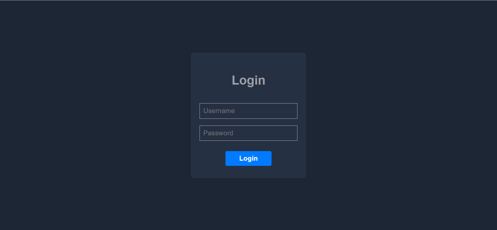
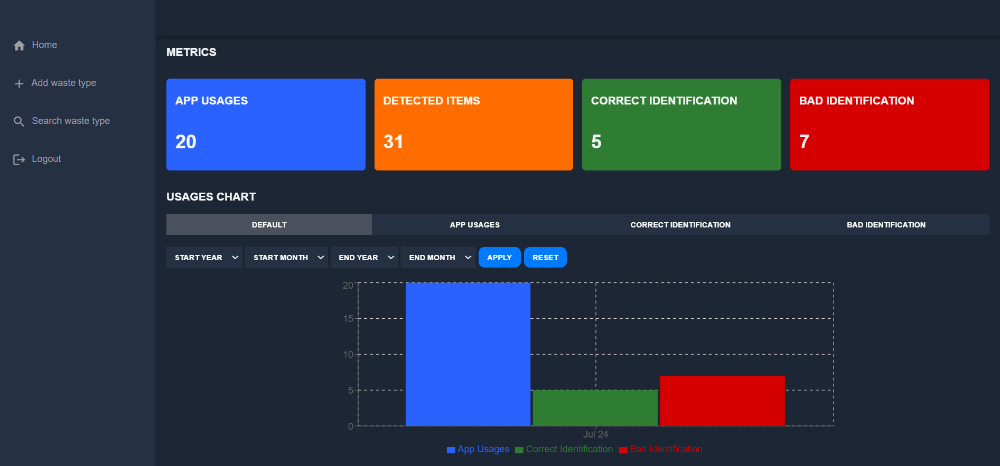
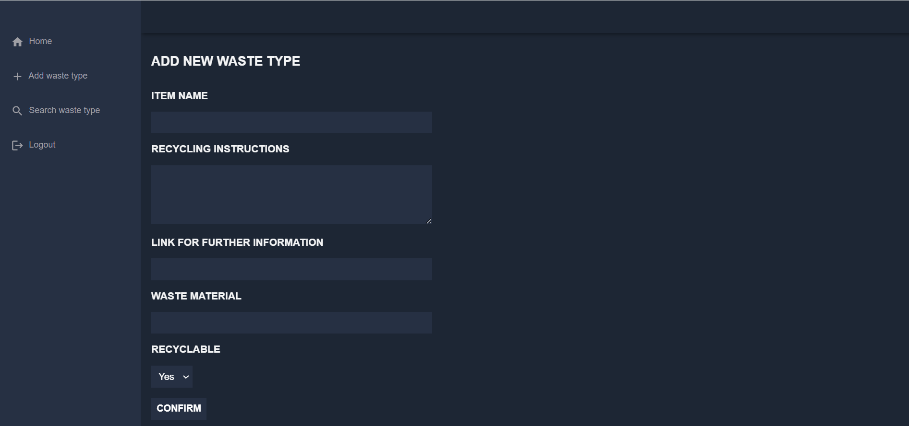
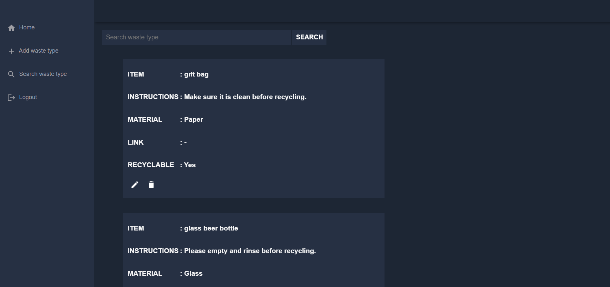
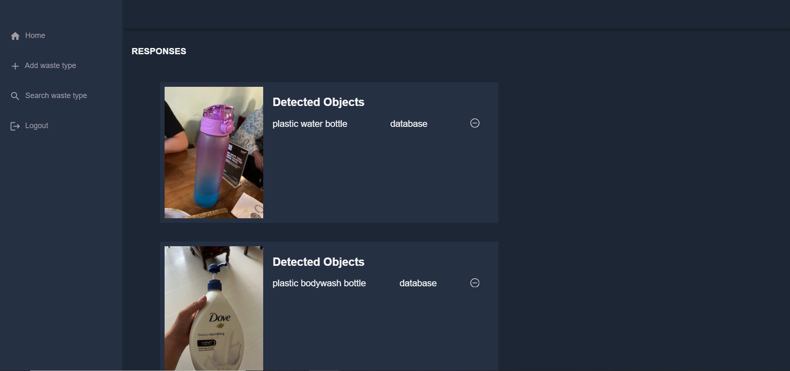

<!-- Improved compatibility of back to top link: See: https://github.com/othneildrew/Best-README-Template/pull/73 -->
<a name="readme-top" id="readme-top"></a>

<!-- TABLE OF CONTENTS -->
<details>
  <summary>Table of Contents</summary>
  <ol>
    <li>
      <a href="#about-the-project">About the Project</a>
      <ul>
        <li><a href="#built-with">Built With</a></li>
      </ul>
    </li>
    <li>
      <a href="#getting-started">Getting Started</a>
      <ul>
        <li><a href="#prerequisites">Prerequisites</a></li>
        <li><a href="#installation">Installation</a></li>
        <li><a href="#run-the-app">Run the App</a></li>
      </ul>
    </li>
    <li>
      <a href="#screenshots-of-the-app">Screenshots of the app</a>
    </li>
  </ol>
</details>


<!-- ABOUT THE PROJECT -->
## About the Project
The project is designed specifically for administrators to efficiently manage waste types and gain insights into mobile app usage.

The frontend provides a user-interface for admin to manage waste types and reports mobile app usage metrics. 


### Built With

* [![React][React.com]][React-url]
* [![MUI][MUI.com]][MUI-url]


<!-- GETTING STARTED -->
## Getting Started
### Prerequisites
1. [Node.js] installed
2. Admin-backend repository running

### Installation
1. Clone the repo
   ```sh
   git clone https://github.com/StanfordDC/admin-frontend.git
   ```
2. Install project dependencies
    ```sh
    npm install
    ```

### Run the App
1. Replace variable in curly braces in API.jsx with admin-backend url
    ```sh
    export const BASE_ENDPOINT = '{admin-backend url}/v1';
     ```
2. Change directory to root
   ```sh
   cd admin-frontend
   ```
3. Run the app
    ```sh
    npm run dev
    ```

<!-- SCREENSHOT OF THE APP -->
## Screenshot of the App
1. Login Page

2. Home Page

3. Add Waste Type Page

4. Search Waste Type Page

5. User Responses Page


<p align="right">(<a href="#readme-top">back to top</a>)</p>


[MUI-url]: https://mui.com/
[MUI.com]: https://img.shields.io/badge/Material--UI-0081CB?style=for-the-badge&logo=material-ui&logoColor=white
[Node.js]: https://nodejs.org/en
[React-url]: https://legacy.reactjs.org/
[React.com]: https://img.shields.io/badge/React-20232A?style=for-the-badge&logo=react&logoColor=61DAFB
